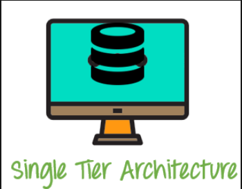
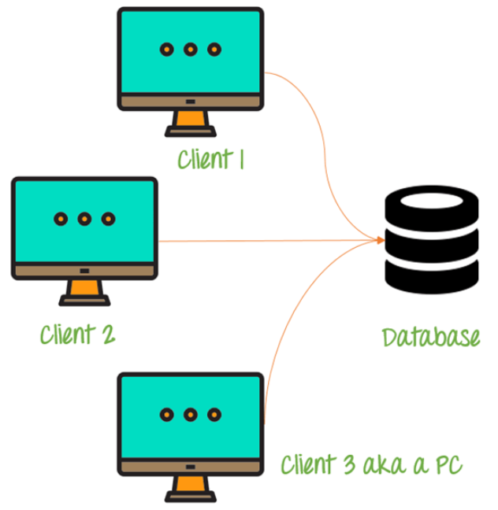
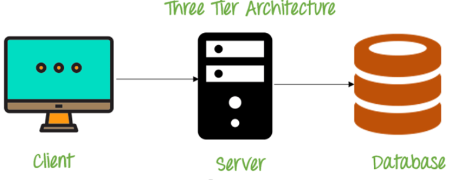

## What is Database?
Database is a structured collection of data that is stored, maintained and can be retrieved efficiently when needed. For example, an application can store user's transactions data and personal data to keep track of the users and the transactions

## What is DBMS?
DBMS stands for database management system. It is a software that eases the creation, manipulation and administration of databases. It also provides interface for users to interact with the database to store, retrive, modify the data in the database.

## Why is it needed?
DBMS is needed for data security, recovery and backup of data. It helps in scalability ,performance and data independence in a system

## File Management system and DBMS 
### File management System :
1.  FMS follows a heirarchical structure of storing data when data is stored in different files and directories
2.  It lacks specifying relationship between data
3.  FMS provides no backup and there is no means to recover the data once it is damaged
4.  There is no language or scripts that can help in query data from FMS. The users/ develops need to implement logic for querying data  themselves.

### Database management System :
1.  DBMS organizes data into different tables according to predefined schemas
2.  There are different type of keys that can be assigned in a table to specify relationship between data
3.  Follows data independency , that means we can modify specific data without altering others
4.  It provides for backups and recovery of data
5.  SQL (structured query language) languages are used to query data from DBMS

## What is database admin and its function?
Database admin (DBA) is a user with the access of whole database and is responsible for maintainance,management and organization of the database system. 
They are responsible for diagnosing and troubleshooting database related problems and also implementing security measures in the database.

## Database Tier 1 , Tier 2 and Tier 3 architecture :
#### 1.  Tier 1 architecture :

In this architecture, the database, user interface(client) and the database server all reside in the same machine

#### 2.  Tier 2 architecture :

In this architecture, the presentation layer is present on a client machine such as mobile,tablet, laptop and the database is stored on a server called the second tier. This architecture is much secure than tier-1 because DBMS is not exposed to the client directly.

#### 3.  Tier 3 architecture :

This is the most popular achitecture used. In this architecture, the development and maintainance of functional processes and storage are done independently as seperate modules. There are 3 layers - presentation, application and database server.
presentation layer is the client side which is responsible for user interation
application layer is the middleware layer which communicates the request of users to the database server