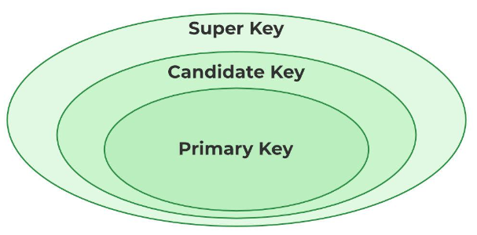

## Keys
Keys are attributes which can identify the row in the relation (table) uniquely.
For example in a student table , the keys can be student id, class, section,etc.
 

##### They are of following types :

### Primary Key:
Out of many candidate keys , the key which identifies an entity uniquely is choosen as primary key.
It cannot be NULL,and more than one column can constitute a primary key. It is the responsibility of database admins to set a primary key which has a unique value for each row in the table.

### Candidate Key:
candidate key is an attribute or a set of attributes which uniquely identifies a tuple. They are as strong as primary key. For example, to identify a citizen there can be many candidate keys such as PAN number, SSN, Voter Id number which can be chosen as candidate keys.
Characteristics:
1. It can contain NULL values.
2. Every table must have at least a single candidate key.
3. It is a super key with no repeated data is called a candidate key.

### Super Key :
It is set of attributes which can uniquely identify a tuple.Adding zero or more attributes to the candidate key generates the super key.. For example, a super key can be EMPLOYEE_NO and EMPLOYEE_NAME.It supports NULL values. 

### Foreign key :
Foreign keys are the column of the table used to point to the primary key of another table. 
The table in which the primary key is present is called **Referenced table**  or the **Parent Table** of the table in which the foreign key is present.

In this image Stud_ID is primary key in the student table and is referenced to in the Department table. Thus both of the tables are related.
Characteristics :
1. Cascading : When the rows in the Parent table are deleted, the rows in the child table(the one holding the foreign key) is also deleted. (this maintains referential integrity in the database)

### Alternate key /Secondary key:
The candidate keys other than the primary key are called alternate keys.

### Composite key /Compound key :
A composite key is the key having two or more attributes that together can uniquely identify a tuple in a table.Such keys are needed in joined tables . For example a table containing customer and product details may have customer_id+product_id as a composite key for the table.