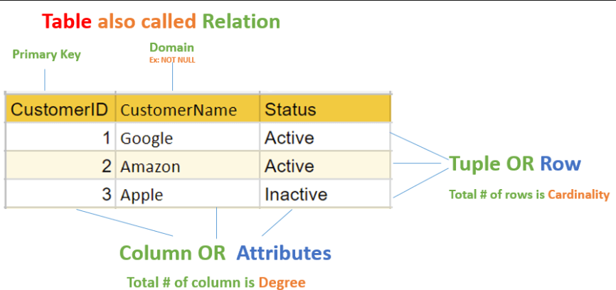

## Relational Database 
Relational database is a type of database that stores and provides access to data points which are related to each other.Relational database is arranged in different tables. Each row of the table is associated with a unique value called key and the columns hold the values of different attributes related to each other.

### How is it stored in the memory?
The data is stored in the form of tables which map keys with the attributes and stores values of attributes.
The key of rows is a unique value to identify the value in the table. 