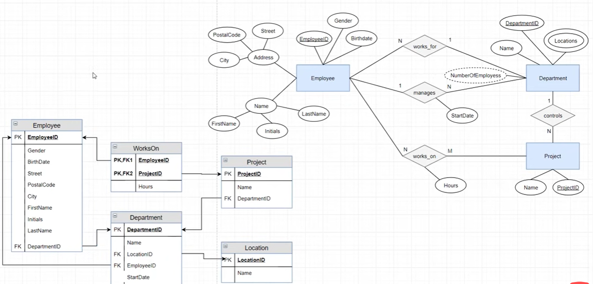

1.  For 1:1 Relationship no additional table or insertion of foreign key is required
2.  For 1:n relationship the department ID foreign key is inserted in the projects table. every project will have only one foreign key as department id.
3.  For n:1 relationship one employee can be associated with one department only so employee table will have department id as a foreign key.
4.  for n:m relationship another table for 'works on' must be made with two foreign key as employee id and project id. they both are considered as a primary key.

Additional points:
1. The derived attributed are not written in the relational table
2. The composite attribute have their own table with the parent table having location's primary key as its foreign key.
