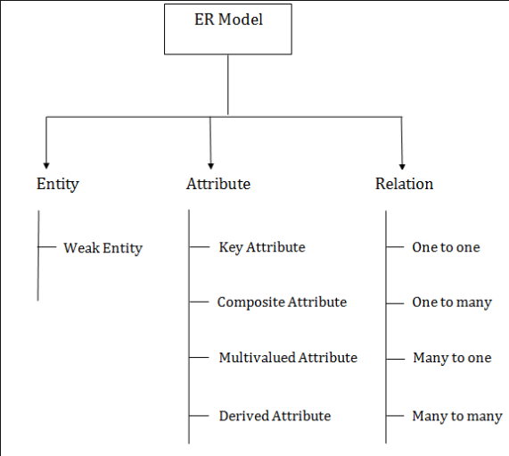

## ER diagram

1. Entity:
Entity can be an object,place or person . For example in an organization schema, entities can be managers, products, employees,etc.
Represented as a rectangle
    a. Weak Entity:
    Weak entity is an entity which depends on other entity for its values. It does not contain any key attribute of its own. For example, Loan is a an entity which helps in determining value of installments of that loan.
    b. Strong Entity:
    String entity is an entity which does not depends on other entity for its values.

2. Attribute:
It is used to decribe a property of an entity. for example employee name , dept number, etc can be attributes of an employee.
Represented as an eclipse.
These are of 4 types:
    a. Key Attribute:
    The primary key of the entity is the key attribute shown by an underlined text in an eclipse.
    b. Composite Attribute:
    The attribute composed of many other attributes is called composite attribute.For example, composite attribute name can be composed of first, middle and last name.
    c. Derived Attribute:
    The attributes whose value is determined by another attribute is called derived attribute. For example, 
    Age can be derived from date of birth.
    d. Multi valued Attribute:
    The attributes that can have more than one value for a single entity is called multi valued attribute. It is represented by double oval . For example a person can have many phone numbers.

3. Relation :
It is used to determine the relation between the entities. Diamond is used to represent a relation.
They can be of 4 types :
    a. one to one relation:
    when a single entity is associated with a single entity only.
    For example, 
    one female marries one male and vice versa.
    b. many to one relation:
    when multiple entities are associated with a single entity.
    For example,
    A student can take one course(/degree) but a course can have many students.
    c. one to many relation:
    when a single entity is associated with multiple entities.
    for example, a scientist can invent many inventions but an invention can only be done by one scientist.
    d. many to many relation:
    when many entitiies are associated with multiple entities.
    for example, many employee can be associated with many managers.And managers can have several employees under them.